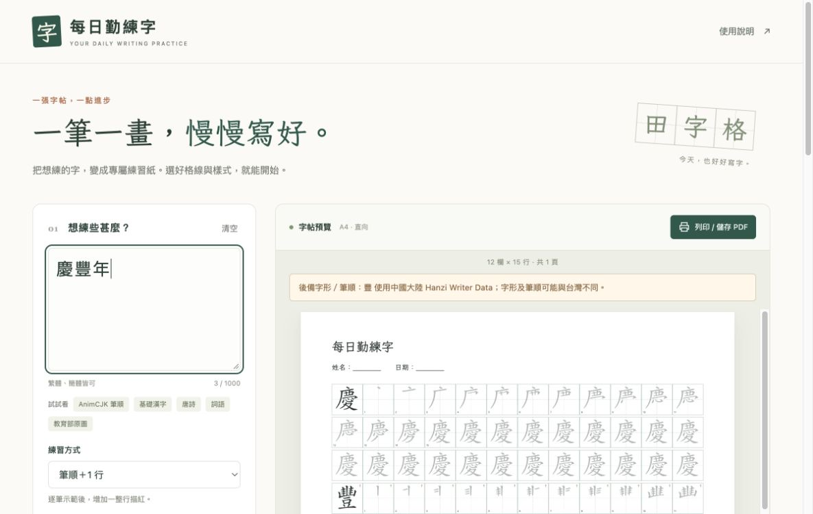
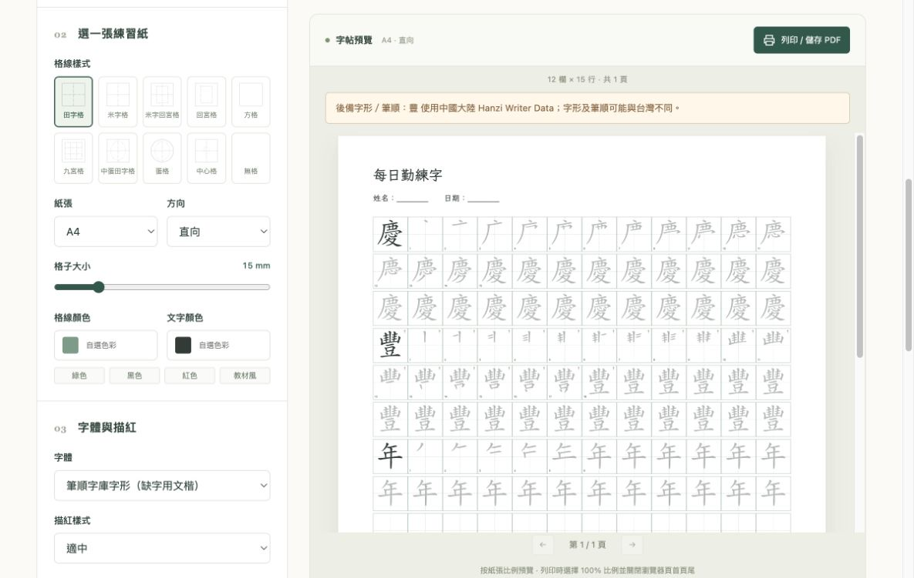

# 每日勤練字 — Node.js 田字格字帖產生器

以 [一份愛田字格字帖產生器](https://www.an2.net/tools/worksheet/tianzige) 的操作與排版行為為參考，獨立實作繁體中文網站。Node.js 原生 HTTP 伺服器、原生 JavaScript 和 SVG，不需要資料庫或 npm 執行期依賴。字型及社群筆順隨專案附上，可離線產生及列印字帖；台灣教育部原圖須由使用者另行下載安裝，官方動畫及香港查詢則需連線。

**預設字形及筆順來源為 AnimCJK 繁體（台灣）**，內建 1,013 字。首次開啟及重設設定皆選用此字庫；選用「筆順字庫字形」時，各練習模式預設開啟 Hanzi Writer Data（中國大陸）缺字後備，可取消勾選。點「AnimCJK 筆順」即可預覽逐筆示範與描紅。筆畫資料隨 Docker 映像附上，使用時無需連線 GitHub。

## 畫面預覽





截圖以「慶豐年」示範：「慶」「年」使用 AnimCJK 繁體筆順，「豐」使用已標示的 Hanzi Writer Data（中國大陸）缺字後備。截圖沒有使用台灣教育部原圖；其中的筆順圖形仍依 Arphic 授權使用。

## 授權與字庫來源

**本專案原創程式碼與文件採 [MIT License](LICENSE-MIT)，Copyright (c) 2026 Jack Cheung。** 預設下載包及 Docker 映像只隨附社群筆順與文楷字型；它們各自保留原授權，不適用 MIT。教育部原圖未隨附，選用安裝後須遵守非商業、署名及禁止改作條件。詳見[完整授權範圍](LICENSE)。

| 專案檔案 | 來源 | 適用授權 |
| --- | --- | --- |
| [台灣筆順資料](data/tw.json.gz)、[AnimCJK 衍生字型](public/fonts/AnimCJKWorksheet.otf) | [AnimCJK 繁體字形，固定版本](https://github.com/parsimonhi/animCJK/blob/ec5e17cca76c87587790bcbce5ea0b4d4fb753d6/graphicsZhHant.txt) | [Arphic Public License](public/licenses/ARPHICPL.txt)；[上游說明](https://github.com/parsimonhi/animCJK/blob/ec5e17cca76c87587790bcbce5ea0b4d4fb753d6/licenses/COPYING.txt) |
| [中國大陸筆順資料](data/cn.json.gz) | [Hanzi Writer Data](https://github.com/chanind/hanzi-writer-data) 2.0.1，源自 [Make Me a Hanzi](https://github.com/skishore/makemeahanzi) | [Arphic Public License](public/licenses/ARPHICPL.txt)；[上游說明](https://github.com/chanind/hanzi-writer-data#license) |
| [內建文楷字型](public/fonts/WorksheetKai.ttf) | [LXGW WenKai TC Regular，固定版本](https://github.com/lxgw/LxgwWenKaiTC/blob/55e77118285a064250abd0324da312223806368a/fonts/TTF/LXGWWenKaiTC-Regular.ttf) | [SIL Open Font License 1.1](public/licenses/LXGW-OFL.txt) |
| 教育部全筆順原圖資料（選用，未隨附） | [中華民國教育部《國字標準字體筆順學習網》](https://stroke-order.learningweb.moe.edu.tw/resource.jsp?ID=1) | [CC BY-NC-ND 3.0 TW](https://stroke-order.learningweb.moe.edu.tw/page.jsp?ID=52)，非商業、署名、禁止改作；[資料聲明](public/licenses/MOE-NOTICE.txt) |

完整來源、版本和修改紀錄見[第三方資料聲明](public/licenses/NOTICE.txt)。上述授權範圍依各上游的授權聲明整理；教育部原圖的具體使用情況仍須遵守其[官方版權說明](https://stroke-order.learningweb.moe.edu.tw/page.jsp?ID=52)。

## 本機執行

使用 Node.js 24 或以上：

```sh
cd kanlinji
npm start
```

開啟 <http://127.0.0.1:3000>。無需先執行 `npm install`。

```sh
# 自訂埠；若要讓區域網路存取，可指定 HOST=0.0.0.0
PORT=8080 npm start

# 修改伺服器後自動重啟
npm run dev
```

## Docker

```sh
docker compose up --build -d
```

開啟 <http://localhost:3000>。更換對外連接埠：

```sh
PORT=8080 docker compose up --build -d
docker compose logs -f
docker compose down
```

亦可直接使用 Docker：

```sh
docker build -t kanlinji .
docker run --rm --init -p 3000:3000 --read-only kanlinji
```

映像使用 `node:24-alpine`，建置階段執行測試，執行階段採用非 root 的 `node` 使用者。Compose 包含唯讀檔案系統、健康檢查與重新啟動設定。預設不需掛載磁碟或設定資料庫；教育部原圖檔也不會進入 Docker 建置內容。首次建置需下載 Node 基底映像；完成建置後網站及隨附字庫可以在無外網環境執行。選用教育部原圖時，按下方[安裝步驟](#選用安裝台灣教育部原圖)以唯讀方式掛載本機資料。

## 功能

| 類別 | 功能 |
| --- | --- |
| 練習模式 | 原有 12 種：整行、半行、加空行、筆順組合、多詞、多句、文章等；另加選用的「台灣教育部・原版筆順＋練習格」 |
| 教育部資料與線上查詢 | 額外安裝教育部資料後，可離線使用 6,063 字原版全筆順提示；台灣線上動畫與香港教育局逐字查詢無需安裝這份資料，但須連線至來源網站 |
| 格線 | 田字格、米字格、米字回宮格、回宮格、方格、九宮格、中蛋田字格、蛋格、中心格、無格，共 10 種 |
| 紙張 | A4、Letter、直向／橫向、自動分頁、12–28 mm 格子、尾頁填滿空格 |
| 外觀 | 格線與文字各自選色、4 種配色、6 級描紅深淺、不可見、空心、立體 |
| 字型 | 內建文楷、筆順字庫完整字形、已安裝的龐中華／田英章字體、自訂本機字型 |
| 頁頭 | 自訂標題、姓名日期等欄位、座右銘、自訂文案、隱藏資訊欄 |
| 預覽 | 即時更新、翻頁、每行由右向左排列、手機版介面 |
| 輸出 | 瀏覽器列印所有頁，或使用「另存為 PDF」 |

### 輸入方式

- **單字／筆順**：直接輸入漢字，忽略空白及標點，保留基本筆畫符號與異體字。
- **多詞**：`春天 | 花草 | 山川`；亦支援逗號、頓號與空白分隔。重複完整詞語，較長詞語會換行保留。
- **多句**：`春天來了。|今天真美好。`，每句各自在獨立頁面重複。超長句子自動擴展頁數。
- **文章**：保留標點與段落換行，不重複內容。
- **空白格紙**：清空輸入即可產生。
- 每次最多 1,000 個 Unicode 字元、100 頁；超出時顯示提示。

### 列印

按「列印 / 儲存 PDF」，在 Chrome 或 Edge 的目的地選擇印表機或「另存為 PDF」。使用設定中的紙張尺寸、100% 比例、關閉瀏覽器頁首頁尾。格線以 SVG 繪製；列印包含所有頁，並保留色彩與精確的毫米尺寸。

## 與參考站的差異及資料限制

參考站的 [12 種模式與選項](https://www.an2.net/tools/worksheet/tianzige) 已按實際輸出行為實作；本專案另提供格子尺寸調整，頁面依實際紙張尺寸配置欄數，因此橫向欄數與參考站不同。文章換行會保留為段落。座右銘依頁次輪替，確保預覽及列印一致。

**字庫覆蓋範圍不同，並非參考站私有字庫的複製品：**

| 地區 | 內建資料 | 字數 | 限制 |
| --- | --- | ---: | --- |
| 中國大陸 | Hanzi Writer Data 2.0.1 | 9,574 | 含繁簡字，傳統字形也依中國大陸筆順 |
| 台灣官方（選用，未隨附） | 中華民國教育部「全筆順提示」PNG 原圖 | 6,063 | 自行安裝後啟用獨立練習模式；CC BY-NC-ND 3.0 TW，非商業、署名、禁止改作 |
| 台灣社群（預設） | AnimCJK `graphicsZhHant.txt` | 1,013 | 可調色逐筆描紅，並非官方完整字庫 |
| 香港教育局 | 《香港小學學習字詞表》正常 POST 查詢 | — | 另開教育局原頁；未打包香港筆畫資料 |

選擇預設的「筆順字庫字形」時，各種練習方式都優先使用繁體 AnimCJK 的逐字字形；缺字才啟用 Hanzi Writer Data（中國大陸）後備。後備字會在預覽提示及印頁標明來源，可取消勾選「AnimCJK 缺字時，以中國大陸字形及筆順補上」。例如「為甚麼」中，「為」「麼」用 AnimCJK，「甚」用九筆的中國大陸後備資料；其字形及筆順可能與台灣教育部標準不同。兩庫均缺字時只顯示字體範字，不生成假筆順。自行安裝教育部原圖後，獨立模式不套用後備，缺字標示「未收錄」並保留練習格，例如收錄「裡」但未收錄「裏」。字庫之外的文字是否有字形，仍取決於文楷／使用者字型的 Unicode 覆蓋範圍。

### 台灣教育部模式與港台查詢

未安裝教育部資料時，介面會停用「教育部原圖」範例及「台灣教育部・原版筆順＋練習格」模式，其餘練習方式與港台線上查詢照常使用。[安裝原圖](#選用安裝台灣教育部原圖)並重新啟動後，這兩個選項會自動啟用。每個字顯示完整原圖，旁邊有兩欄練習格；依紙張自動分頁，保留重複字及輸入順序。可調整格線、格子大小、紙張及頁頭。原圖的色彩、留白與長寬比例保持原樣，不能套用描紅／字體設定。建議直向列印；原始 PNG 解析度有限。

**已核實的來源與條款：**教育部[版權說明](https://stroke-order.learningweb.moe.edu.tw/page.jsp?ID=52)將「筆順動畫」「全筆順提示」以 CC BY-NC-ND 3.0 TW 釋出，並允許非商業 iframe 引用。選用匯入工具保留原圖 PNG 位元組；網站將其與練習格分開排列，每張印頁附教育部署名、網站及授權網址，不裁切、拆圖、改色或轉成自製筆畫。**授權解讀：**我們依 [CC 條款](https://creativecommons.org/licenses/by-nc-nd/3.0/tw/legalcode)關於完整作品彙編的規定處理；這不是教育部對本專案的個別認可，不能推論其他改作或商業用途亦獲授權。

下方「港台筆順來源查詢」可選取輸入中的任一漢字：台灣按鈕載入教育部 iframe；香港按鈕以教育局原本的 POST 表單開啟教育局原頁。只有點擊時才把選取的單字傳送至該網站。香港教育局的[使用要則](https://www.edbchinese.hk/lexlist_ch/fw_principle.html)把筆順定位為教學參考；這裡不宣稱它是唯一書寫方式，也沒有將其素材重新託管。

**程式碼與資料授權分開處理：**自行安裝的教育部原圖仍受非商業、署名及禁止改作條件限制，不能改標為 MIT。[教育部資料聲明](public/licenses/MOE-NOTICE.txt)及列印署名須隨原圖保留；各檔案的授權範圍見上方[授權與字庫來源](#授權與字庫來源)。

本機字體須安裝在**瀏覽器所在的電腦**，不需安裝在容器內。龐中華、田英章字體未隨專案分發；未安裝時使用文楷。預設字體下，輸入欄沿用網站正文及設定標題的字體；字帖各模式則逐字使用相同字庫路徑，故多字整行與筆順模式的同一字形一致。AnimCJK 已收錄字維持 AnimCJK 路徑；後備字的範字、逐筆及描紅全程使用 Hanzi Writer Data 路徑。不同來源的字形風格仍可能有別，印頁會標出後備字；兩庫都缺字才用文楷字體。選擇系統黑體或其他已安裝字體會改變輸入欄、範字及描紅；逐筆筆畫仍按實際選用的字庫呈現。

### 匯入額外地區筆順

可把有適當授權並已核實標準的 `hk.json.gz` 放入 `data/`，重新啟動後香港選項會自動啟用。格式為 UTF-8 JSON 經 gzip 壓縮：

```json
{
  "一": {
    "paths": ["M ... Z"],
    "transform": "translate(0 900) scale(1 -1)"
  }
}
```

`paths` 是依書寫順序排列的 SVG 封閉筆畫輪廓；座標空間為 1024 單位。若資料採向下 Y 軸，請依來源調整 transform。`DATA_DIR` 可指定含必需的 `cn.json.gz`、`tw.json.gz`，以及選用的 `moe.json.gz`、`hk.json.gz` 的其他目錄。重新建置映像可納入額外筆順字庫；教育部原圖須依下方步驟另行掛載，不得納入預設映像。請一併更新來源與授權聲明。

內建社群字庫另包含 `_notice` 欄位，記錄來源、版本、授權及修改日期／方式；它不計入字數。重新分發資料時須保留此聲明及 `public/licenses/` 內的完整授權文件。

## 測試

```sh
npm test
npm run check
```

測試涵蓋原有 12 種排版及官方原圖模式、分頁內容完整性、長詞與長句、Unicode、逐筆累加、缺字、SVG 跳脫、A4／Letter 不同方向及尺寸、HTTP 路由和字庫 API。教育部模式使用合成測試資料，驗證沒有安裝、另行安裝及資料損壞時的行為；測試不需要下載官方原圖。

自動測試會檢查跨模式字形一致性、AnimCJK 優先及缺字後備，包括「為甚麼」的來源標示。Docker 建置時也會執行上述測試。官方線上動畫的顯示仍取決於教育部網站及瀏覽器連線；本機原圖與字帖列印不依賴動畫服務。

健康檢查：`GET /healthz`；字庫資訊：`GET /api/meta`。

```sh
curl http://localhost:3000/api/strokes \
  -H 'Content-Type: application/json' \
  -d '{"characters":"永學","standard":"cn"}'
```

`GET /api/meta` 的 `officialTaiwan.available` 表示有沒有安裝教育部原圖。安裝後可用 `POST /api/official-tw`，JSON 內容 `{"characters":"永裡𥑮"}`，回傳 `characters`（PNG 原始位元組的 Base64、尺寸、官方頁／動畫連結）與 `missing`；未安裝則回傳 HTTP 503。伺服器只從本地讀取原圖。

## 結構

```text
server.js                 Node.js 靜態檔案與字庫 API
public/index.html         設定與預覽介面
public/app.js             表單、字庫載入、預覽與列印
public/worksheet.js       純函數排版、SVG 繪製
public/style.css          響應式介面與列印樣式
public/fonts/             隨附字型
public/licenses/          上游授權與修改聲明
docs/                     網站畫面截圖
data/                     內建筆順資料；選用的 moe.json.gz 受 Git 忽略
test/                     Node.js 內建測試
scripts/import-data.py    可重現的字庫轉換工具（維護時才需 Python）
scripts/build-anim-font.py 從 AnimCJK 筆畫產生字體檔（維護時才需 Python 與 fonttools）
scripts/import-moe.py     驗證並封裝教育部原始 PNG（不改動圖片）
Dockerfile                測試與執行映像
compose.yaml              一鍵啟動
compose.moe.yaml          選用教育部原圖的唯讀掛載
LICENSE                   多授權範圍說明
LICENSE-MIT               原創程式碼與文件的 MIT 條文
```

## 字庫來源與重建

原始資料固定版本：

- [Hanzi Writer Data 2.0.1](https://registry.npmjs.org/hanzi-writer-data/-/hanzi-writer-data-2.0.1.tgz)，其 [Make Me a Hanzi 上游](https://github.com/skishore/makemeahanzi) 指明中國大陸筆順。
- [AnimCJK 台灣資料](https://raw.githubusercontent.com/parsimonhi/animCJK/ec5e17cca76c87587790bcbce5ea0b4d4fb753d6/graphicsZhHant.txt)。
- [LXGW WenKai TC Regular](https://raw.githubusercontent.com/lxgw/LxgwWenKaiTC/55e77118285a064250abd0324da312223806368a/fonts/TTF/LXGWWenKaiTC-Regular.ttf)。

前兩項依序下載至 `/tmp/hanzi.tgz`、`/tmp/graphicsZhHant.txt`，再執行：

```sh
python3 scripts/import-data.py /tmp/hanzi.tgz /tmp/graphicsZhHant.txt
```

工具先檢查來源 SHA-256，再擷取筆畫路徑並生成可重現 gzip。字庫維持 Arphic Public License，文楷維持 SIL OFL 1.1。詳情見 [NOTICE](public/licenses/NOTICE.txt) 及 [網站授權頁](public/about.html)。

`public/fonts/AnimCJKWorksheet.otf` 由固定版本的台灣 AnimCJK 字庫產生，保留於專案作衍生資產，目前輸入欄不會載入它，避免字庫覆蓋不足時混排。需要重建時，在獨立 Python 環境安裝 `fonttools==4.60.1`，執行 `python scripts/build-anim-font.py`。字體屬 Arphic Public License 衍生資料；Docker 不需 Python。

### 選用安裝台灣教育部原圖

此資料**不在 Git 儲存庫或 Docker 映像內**。先閱讀教育部的[官方版權說明](https://stroke-order.learningweb.moe.edu.tw/page.jsp?ID=52)：全筆順提示及筆順動畫採 [CC BY-NC-ND 3.0 TW](https://creativecommons.org/licenses/by-nc-nd/3.0/tw/legalcode)，使用須符合非商業、署名及禁止改作條件。

從官方[教學資源](https://stroke-order.learningweb.moe.edu.tw/resource.jsp?ID=1)下載「全字筆順提示 ZIP」及「全筆順動畫嵌入碼網址列表 CSV」，分別存為 `/tmp/6063png.zip`、`/tmp/iframe-index.csv`。在專案目錄執行（只需 Python 3，無需額外套件）：

```sh
python3 scripts/import-moe.py /tmp/6063png.zip /tmp/iframe-index.csv
```

工具固定核對兩個來源的 SHA-256，處理 ZIP 中混合的 Unicode／Big5 檔名，比對完整 6,063 字清單，再原封不動封裝 PNG。輸出 `data/moe.json.gz` 為 15,276,018 bytes，SHA-256：`5540626da99a8f307dd11d19e71c461400ba5e6386b9acfd951c2fd2866cad35`。更新上游版本時需重新檢查字數、來源及授權，再更新固定雜湊。來源雜湊及每圖版權說明見 [MOE-NOTICE](public/licenses/MOE-NOTICE.txt)。檔案已由 `.gitignore` 及 `.dockerignore` 排除。

本機使用時重新啟動 `npm start`。Docker 使用以下選用設定，將本機檔案唯讀掛載到容器；預設 Docker 映像仍不包含原圖：

```sh
docker compose -f compose.yaml -f compose.moe.yaml up --build -d
```

若官方下載的檔案已更新而核對失敗，請先核實新版本的內容和授權，再修改匯入工具的固定雜湊；不要略過驗證。
